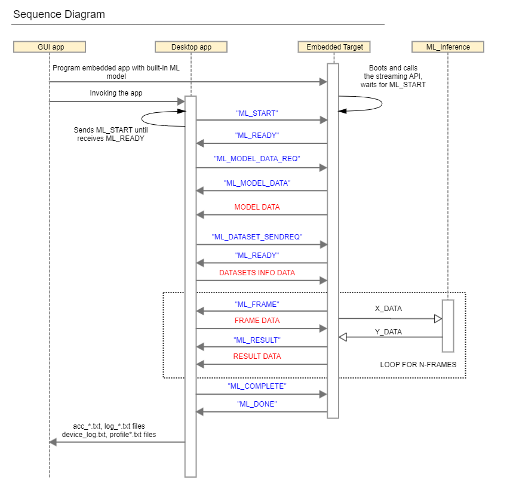

[Click here](../README.md) to view the README.

## Design and implementation

In this example, you must provide a pre-trained NN model with the weights, regression data, and model parameters. The ModusToolbox&trade;-ML Configurator tool can generate such data based on the standard Keras H5 format or TFLite format. By default, these files are located in the *./mtb_ml_gen* folder for each core project (`proj_cm55` and `proj_cm33_ns`). The code examples also provide a ModusToolbox&trade;-ML Configurator tool project file *design.mtbml* for each core project, which points to the pre-trained NN model available in the *pretrained_models* folder.

If you change the output file location in the ModusToolbox&trade;-ML Configurator tool, you must also reflect the change in the Makefile (the `NN_MODEL_FOLDER` parameter). The model data is stored as a header file or as a binary file (used for filesystem applications). This example uses header files. Depending on the type of the NN model chosen in the Makefile (the `NN_TYPE` parameter), the application uses the files and variables from the following table, where (*KEY* is the output file prefix defined by the ModusToolbox&trade;-ML Configurator tool):

**Table 1. Inference Engine: tflm**

Folder name | File name | Variable name | Description
:--------   | :-------- | :------------- | :------------ 
*mtb_ml_models* | *KEY_tflm_model_int8x8.h/c* <br> *KEY_tflm_model_int16x8.h/c* <br> *KEY_tflm_model_float.h/c* | `KEY_model_bin` | Contains the NN weights and bias
*mtb_ml_regression_data* | *KEY_tflm_x_data_int8x8.h/c* <br> *KEY_tflm_y_data_int8x8.h/c*<br> *KEY_tflm_x_data_int16x8.h/c* <br> *KEY_tflm_y_data_int16x8.h/c* <br> *KEY_tflm_x_data_float.h/c* <br> *KEY_tflm_y_data_float.h/c* | `KEY_x_data_bin`<br>`KEY_y_data_bin` | Contains the input (x) and output (y) regression data

<br>

**Table 2. Inference engine: tflm_less**

 Folder name | File name | Variable name | Description
 :--------   | :-------- | :------------- | :------------
 *mtb_ml_models* | *KEY_tflm_less_model_int8x8.h/cpp*<br> *KEY_tflm_less_model_int16x8.h/cpp*<br>*KEY_tflm_less_model_float.h/cpp* | No variables, only functions | Contains the TFLM functions implementation
 *mtb_ml_regression_data* | *KEY_tflm_x_data_int8x8.h/c*<br>*KEY_tflm_y_data_int8x8.h/c*<br> *KEY_tflm_x_data_int16x8.h/c*<br>*KEY_tflm_y_data_int16x8.h/c*<br>*KEY_tflm_x_data_float.h/c*<br>*KEY_tflm_y_data_float.h/c* |  `KEY_x_data_bin`<br>`KEY_y_data_bin` | Contains the input (x) and output (y) regression data

<br>

In the *Makefile*, set the `NN_MODEL_NAME` parameter based on the output file prefix chosen in the ModusToolbox&trade;-ML Configurator tool.

You can also change the type of inference engine to run by setting the `NN_INFERENCE_ENGINE` in *Makefile* and options as follows:
1. **`tflm`:** TensorFlow Lite Micro inference engine with a runtime interpreter
2. **`tflm_less`:** TensorFlow Lite Micro inference engine without an interpreter (interpreter-less)

> **Note:** If you are using TensorFlow Lite Micro, only *int8x8* and *float* `NN_TYPE` are supported.

> **Note:** `tflm_less` is not supported with Ethos-U55.

After updating *Makefile*, all the model files are built into the application automatically, allowing the NN inference engine to be initialized and fed with the regression data.

This application has the option to choose the source of the regression data in the *common.mk* file. You can set the `ML_VALIDATION_SOURCE` to one of the following:
   - **`stream`:** Uses the ModusToolbox&trade;-ML Configurator tool to stream the regression data
   - **`local`:** Uses the files located in the *mtb_ml_gen/mtb_ml_regression_data* for the regression data

By default, the CM33 application places the model weights in the SRAM and the CM55 application places the model weights in the SoCMEM for best performance. The application Makefile uses the `CY_ML_MODEL_MEM` to set the location of the model weights.

> **Note:** Some devices from the supported kits may not have enough memory to run some of the configurations listed earlier, particularly when using local regression data. If this occurs, select a different kit with a larger memory device or see the ML user guide on how to define the `CY_ML_MODEL_MEM` macro.

> **Note:** When using a TFLM int8x8 model with local regression data, the model's output is compared to quantized reference int8x8 model results. If using streamed data, the model's output is compared to a float reference model's results. That means the accuracy results may differ depending on whether local and streamed data is used.

The application also has an option to choose what type of profiling/debugging data to print/stream. You can set the `PROFILE_CONFIGURATION` to one of the following:

Configuration | Description  
:--------   | :-------- 
`MTB_ML_PROFILE_DISABLE` | Disables profiling 
`MTB_ML_PROFILE_ENABLE_MODEL` (default) | Enables model profiling 
`MTB_ML_LOG_ENABLE_MODEL_LOG` | Enables model output 
   
<br>

When profiling is enabled, the report includes the average CPU cycles, peak CPU cycles, and peak CPU frame. If a NPU is used, the average NPU cycles, peak NPU cycles, and peak NPU frame are included.

If local regression data are being used, the application automatically loads the regression data generated by the ML Configurator tool. The regression data consists of inputs (X) and outputs (Y). After processes X, the inference engine generates the result. The firmware then compares the result with the desired value, Y. If these conditions are met, the firmware contributes to the calculation of accuracy.

The same regression data is streamed over the UART when using the ModusToolbox&trade;-ML Configurator tool. The following figure shows the communication sequence diagram between the tool and the device.

**Figure 4. Communication sequence diagram**



### Performance improvements for inferencing

**Increasing SoCMEM clock frequency**

The default PSOC&trade; Edge BSP configures the SoCMEM clock (`CLK_HF2`) at 200 MHz. The maximum allowed frequency on SoCMEM is 300 MHz. If the model weights are placed in the SoCMEM, you can configure the SoCMEM clock to be set to 300 MHz in the Device Configurator to improve the performance of inferencing.

**Changing the Ethos-U55 cache management type**

When using the Ethos-U55, you can choose three different cache management types:

- **`MTB_ML_ETHOSU_CACHE_MGMT_ALL_LAYERS`:** Clears and invalidates the cache by address for each layer using cache-API calls within the driver (default option)

- **`MTB_ML_ETHOSU_CACHE_MGMT_CONDITIONAL`:** Clears or invalidates the entire cache based on an internal state. It can reduce the total number of CPU cycles, but it can cause undesired behavior in the application
- **`MTB_ML_ETHOSU_CACHE_MGMT_OUTER_LAYERS`:** Clears the input layer before executing the inference and invalidates the output layer after executing the inference. Use only if all operators are supported by Ethos-U55. It always provides the best performance

You can set `MTB_ML_ETHOSU_CACHE_MGMT_TYPE` in the DEFINES list in *Makefile* or call `mtb_ml_set_cache_mgmt_type()` function to change the cache management type to one of the above options.


### Resources and settings

#### Files and folders

```
|-- proj_cmXX/mtb_ml_gen/               # Contains the generated files by the ML-configurator tool
   |- info                              # Contains reports on the model generation and evaluation
   |- model_gen_dir                     # Contains internal optimized models
   |- mtb_ml_models                     # Contains the C code generated model files
   |- mtb_ml_regression_data			# Contains the C code generated test files
|-- proj_cmXX/pretrained_models/        # Contains the Keras-H5 and TFlite models (used by the ML configurator tool)
|-- proj_cmXX/sample_data/              # Contains test data and calibration data
|-- proj_cmXX/design.mtbml              # ModusToolbox&trade;-ML Configurator tool project file
|-- shared_src/                         # Contains shared code files for the core projects
   |- elapsed_timer.c/h                 # Implements a system tick timer
   |- ml_validation.c/h                 # Implements the validation task (local and streamed)
   |- app_common.h/c                    # Implements the UART and retarget I/O initialization
```

> **Note:** `proj_cmXX` refers to the core projects, `proj_cm33_ns` and `proj_cm55`.

<br>